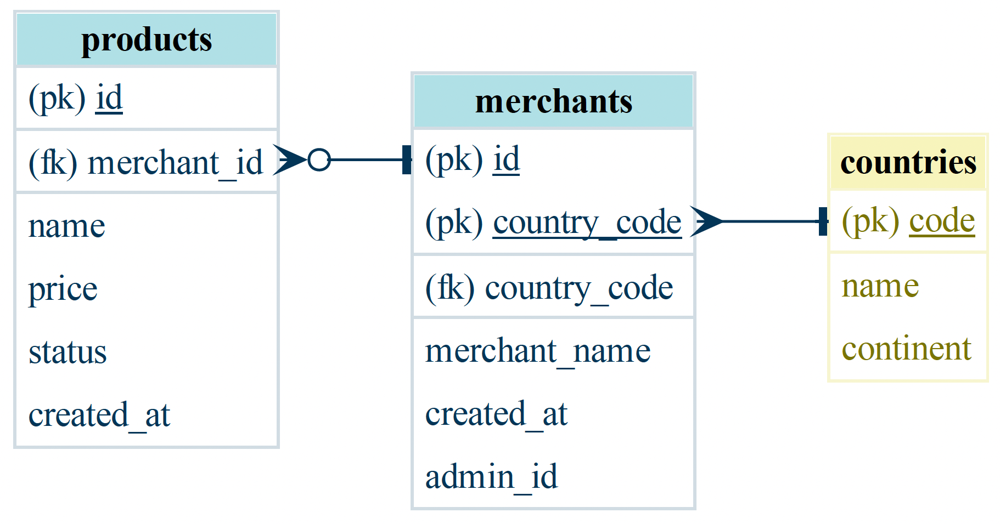
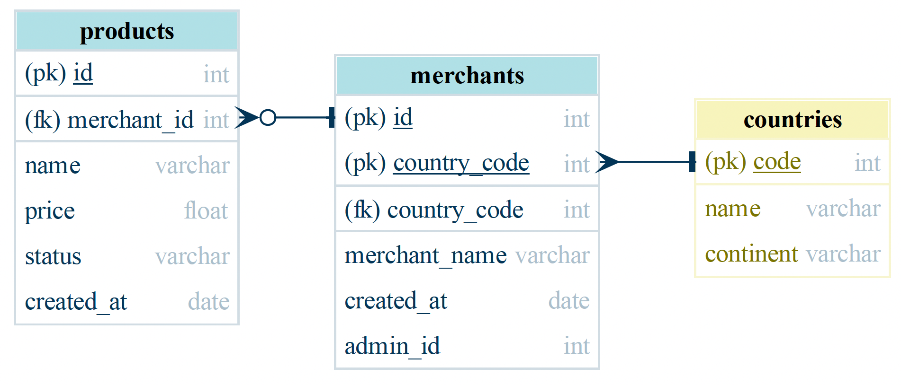
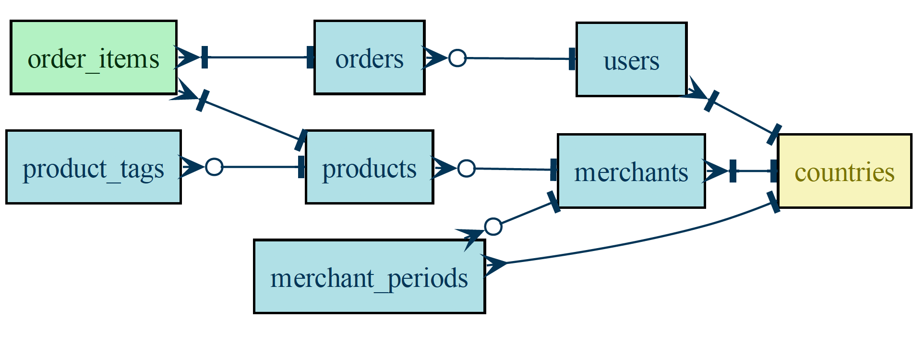
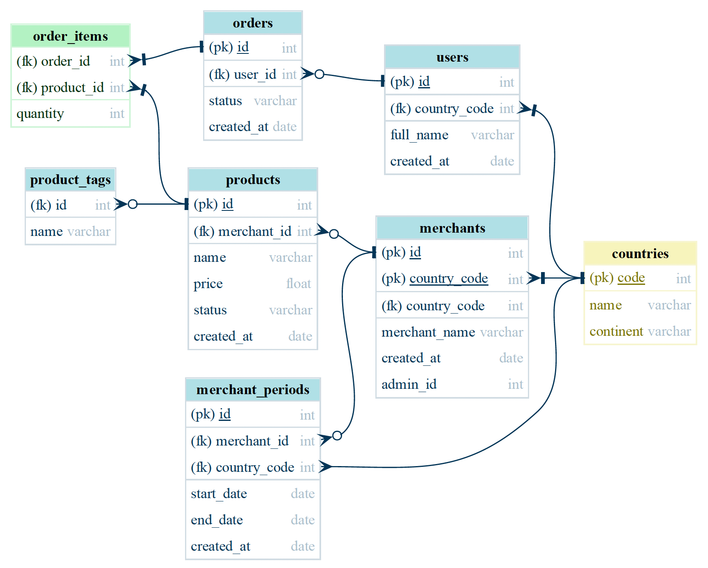

# er-diagram-python
Translates an excel file describing a relational database to an entity-relationship diagram generated by Graphviz.

## Installation
`er-diagram-python` requires [GraphViz](https://www.graphviz.org/download/) available for Windows, Mac and Linux.
clone the repository and install [GraphViz](https://www.graphviz.org/download/) available for Windows, Mac and Linux.
> macOS users can download the Graphviz via `brew install graphviz` if you're using [Homebrew](https://brew.sh).

## Basic Usage
### Command Line format
```usage: generate_pdm.py [-h] [-t {physical,logical,conceptual}] xlsx_file```

working example : `python generate_pdm.py -t physical example/sample_datamodel.xlsx`

> [!NOTE] 
> -t : type of diagram to generate. Default is `physical`. Possible values are `physical`, `logical` and `conceptual`.
>
>| Diagram Type | Description | Example |
>| --- | --- | --- |
>| `conceptual` | Conceptual diagram | |
>| `logical` | Logical diagram | |
>| `physical` | Physical diagram | |


### Excel File Format
`er-diagram-python` requires an excel file describing the database schema. Each sheet describe one table, 3 types of tables are defined by default : 
| Table Prefix | Table Type | Description |
| --- | --- | --- |
| `table` | Entity Table | Main table decribing an entity such as Client, Order, Merchant etc. |
| `table_rel` | Relationship Table | Table describing a link between two entities such as a many-to-many relationship StudentCourse table for example |
| `table_ref` | Referential Table | Table containing a list of values such as a list of countries, a list of cities etc. |

> [!NOTE] 
> More table types can be added by modifying [config_colors.yml](config_colors.yml) file.

Excel sheet name must be formated like this : `table <table_name>`, `table_rel <table_name>` or `table_ref <table_name>`. Sheet not following this format will be ignored.

The sheet decribing the table list all table columns with the following columns in the excel sheet :
| Column Name | Description | Format | Example |
| --- | --- | --- | --- |
| `pk` | Define if the column belong the table primary key | `<status>` | `TRUE` or `FALSE` |
| `fk` | Define if the column is a foreign key | `FK <fk_table_name>.<fk_table_column(optional)> <cardinality left>:<cardinality right>` | FK countries.code 1n:1 |
| `name` | Name of the column | `<name>` | client |
| `type` | Define the column type | `<database type>` | `int`, `float`, `date`, `varchar` |

See [sample_datamodel.xlsx](example/sample_datamodel.xlsx) for a complete example

`er-diagram-python` supports the following database cardinalities :
| Cardinality | Description | Visual |
| --- | --- | --- |
| `1` | One | |
| `n` | Many | |
| `11` | One (and only one) | |
| `01` | Zero or One | |
| `0n` | Zero or Many | |
| `1n` | One or Many | |

## Example
Here is an example leveraging on the 3 types of tables and advanced cardinalities :

### Conceptual Diagram


### Logical Diagram


### Physical Diagram



